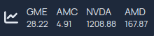

The Stocks Widget allows you to include basic stock market data in your homepage.
The widget includes the current price of a stock, as well as the change in price
for the day.

Finnhub.io is currently the only supported provider for the stocks widget.
You can sign up for a free api key at [finnhub.io](https://finnhub.io).
You are encouraged to read finnhub.io's
[terms of service/privacy policy](https://finnhub.io/terms-of-service) before
signing up. The documentation for the endpoint that is utilized can be viewed
[here](https://finnhub.io/docs/api/quote).

You must set `finnhub` as a provider in your `settings.yaml` like below:
```yaml
providers:
  finnhub: yourfinnhubapikeyhere
```

Next, configure the stocks widget in your `widgets.yaml`:

```yaml
- stocks:
    provider: finnhub
    cache: 1 # Optional/Stocks widget default is to cache results for 1 minute
    watchlist:
      - GME
      - AMC
      - NVDA
      - AMD
```

The above configuration would result in something like this:


